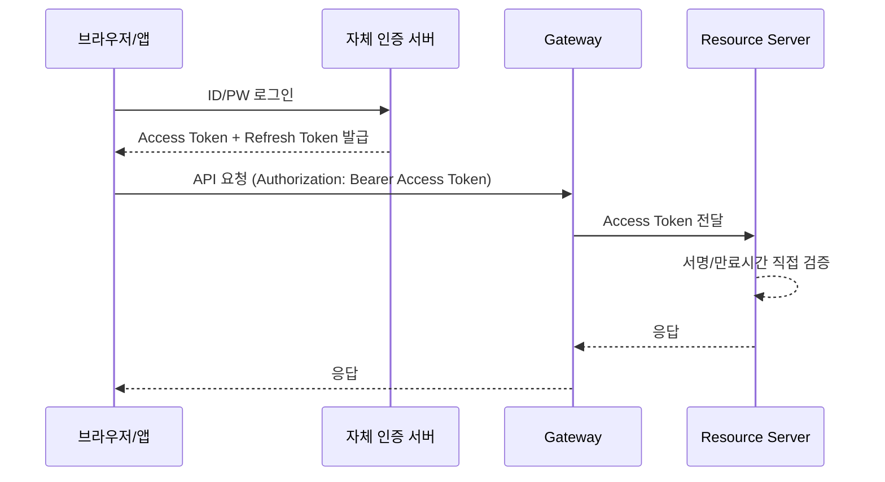
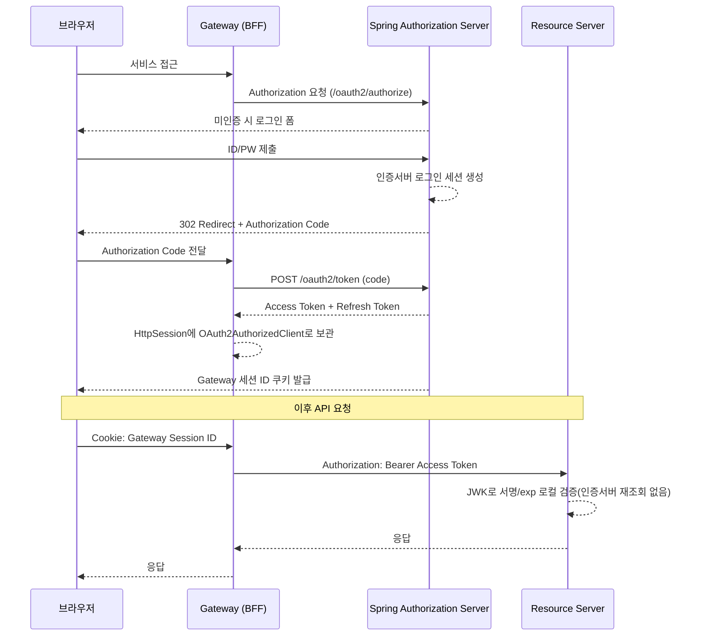
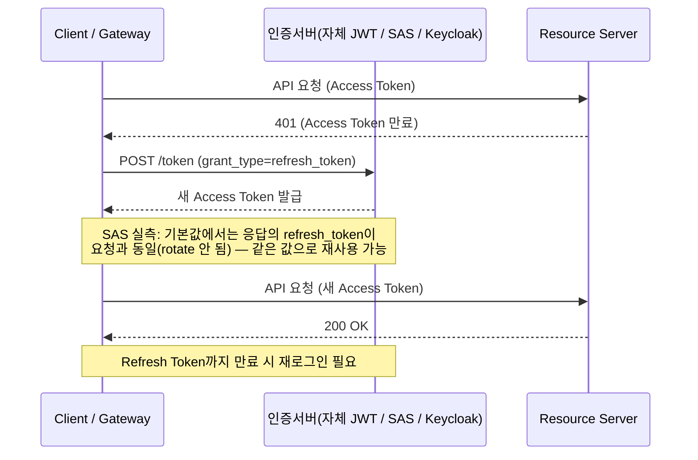
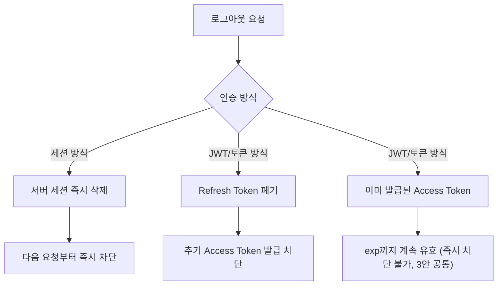
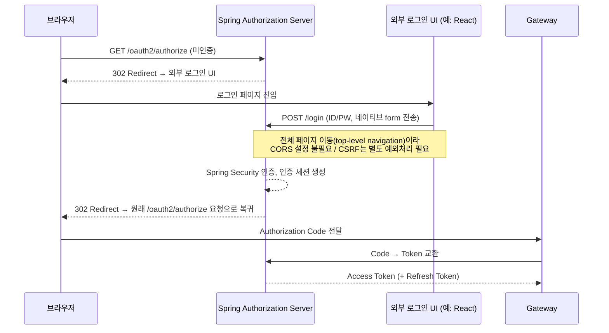

****

- **1안 — 자체 JWT**: 인증서버를 직접 구현 (JWT 발급/검증, Refresh Token 등 전부 직접 설계)
- **2안 — Spring Authorization Server (SAS)**: Boot 4.1 + Gateway + Resource Server 데모 환경에서 아래 6개 항목 전부 실제로 기동/테스트 완료
- **3안 — Keycloak**: 문서/공식 레퍼런스 기준 조사 완료, 실제 구현·테스트는 아직 진행하지 않음

---

## 0. 개요 및 요약

| 구분 | 자체 JWT | Spring Authorization Server | Keycloak |
| --- | --- | --- | --- |
| 성격 | 인증서버를 처음부터 직접 개발 | Spring Security에 내장된 OAuth2/OIDC 인증서버 프레임워크 | 별도 제품(오픈소스 IAM 솔루션) |
| 구현 부담 | 인증/세션/토큰 정책 전부 직접 설계·구현 | 중간 — 프레임워크가 프로토콜을 제공, 세부 정책은 커스텀 필요 | 대부분 기능이 관리 콘솔/설정으로 제공 |
| 관리 UI(사용자·세션 관리 등) | 직접 구현 필요 | 직접 구현 필요 | Admin Console 기본 제공 |
| 검증 상태 | 이벤트유 코드 및 조사 | 데모 환경에서 테스트 완료 | 공식 문서 조사 완료, 실제 구현/테스트 미실시 |

!image.png

---

## 1. 인증/인가 방식 (토큰 / 세션 / 쿠키)

### 1-1. 비교 요약

| 구분 | 자체 JWT | Spring Authorization Server | Keycloak |
| --- | --- | --- | --- |
| 로그인 상태 유지 | 세션 또는 토큰 중 직접 선택·설계 | 인증서버는 Spring Security 세션, Gateway(BFF)는 별도 `HttpSession` | Keycloak 자체 사용자 세션, Gateway(BFF)는 별도 `HttpSession` |
| 브라우저 → 인증서버 쿠키 | 직접 설계 | 인증서버 로그인 세션 쿠키 | Keycloak 세션 쿠키 |
| 브라우저 → Gateway 쿠키 | 직접 설계(세션 ID or 없음) | Gateway 세션 ID (BFF 구조) | Gateway 세션 ID (BFF 구조) |
| Access Token 종류 | JWT 직접 생성 | JWT 또는 Opaque Token 선택 가능 | 일반적으로 JWT |
| Access Token 검증 | 각 서비스가 서명/만료 직접 검증하도록 구성 | Resource Server가 JWK 공개키로 
로컬 검증(매 요청마다 인증서버 조회 불필요) | Resource Server가 Keycloak 공개키로 로컬 검증 |
| Refresh Token | 필요 시 직접 구현(저장/만료/재발급/폐기 정책 전부 설계) | 선택적 발급, Authorization Server 내부 저장소로 관리 | 기본 발급, Keycloak이 세션과 연동해 관리 |

### 1-2. 최초 로그인 및 토큰 발급 흐름

**자체 JWT (토큰 방식)**

**Spring Authorization Server** — ✅ 테스트 완료 (Authorization Code + PKCE 흐름으로 실제 토큰 발급까지 확인) / **Keycloak** 도 동일

### 1-3. 회원 정보 보관 위치 (기존 MySQL 사용 가능 여부)

| 구분 | 자체 JWT | Spring Authorization Server | Keycloak |
| --- | --- | --- | --- |
| 기존 MySQL 회원 테이블 사용 | 가능 | 가능 — ✅ **테스트 완료** | 기본은 불가 — Keycloak 전용 DB 사용이 기본 |
| 인증서버 전용 DB 필요 여부 | 불필요(직접 설계) | 불필요 (OAuth2 Client/Authorization/Consent 데이터도 
JDBC로 저장 가능) | 필요 (Keycloak이 관리하는 사용자·인증 정보는 
Keycloak DB에 저장) |
| 기존 MySQL 연동 방법 | 해당 없음(자체 설계) | 기존 회원 테이블을 Spring Security 인증과 그대로 연결 | `User Storage SPI` 등 외부 사용자 저장소 연동 필요 
— Keycloak 확장 코드 개발·운영 비용 발생 |

---

## 2. 인증 절차 커스텀 (2FA)

| 구분 | 자체 JWT | Spring Authorization Server | Keycloak |
| --- | --- | --- | --- |
| 2FA 가능 여부 | 가능 (전부 직접 구현) | 가능 — ✅ **테스트 완료** (완성된 기능은 아니지만 
Spring Security 7.1 공식 MFA 프레임워크로 구현) | 가능 (Authentication Flow로 관리자 화면에서 구성) |
| TOTP / WebAuthn·Passkey | 직접 구현 | 직접 연동 구현 필요 | 기본 제공 |
| SMS OTP / Email OTP | 직접 구현 | 직접 연동 구현
(발송 채널 커스텀 핸들러) | 기본 미제공 — Custom Authenticator(SPI) 구현 
및 발송 서비스 연동 필요 |

---

## 3. refreshToken 동작 방식

| 구분 | 자체 JWT | Spring Authorization Server | Keycloak |
| --- | --- | --- | --- |
| 저장 위치 | 직접 설계(DB/Redis 등) | Authorization Server 내부 저장소(JDBC 등으로 구성 가능) | Keycloak 세션 및 내부 저장소 |
| 재발급 방식 | 직접 설계 | `grant_type=refresh_token`으로 
Access Token만 새로 발급 — ✅ **테스트 완료** | `grant_type=refresh_token`으로 재발급 (동일 프로토콜) |
| Rotation 기본값 | 직접 설계(정책 자유) | 기본값 `reuseRefreshTokens=true` 
→ **rotate 되지 않고 재사용됨** — ✅ **테스트 완료**
(같은 refresh_token으로 반복 갱신해도 계속 성공) | 설정에 따라 rotation 여부 선택 가능 (문서 기준) |
| 만료 시 동작 | 직접 설계 | Refresh Token까지 만료되면 재발급 불가 → 재로그인 필요 | Refresh Token/세션 상태에 따라 재발급 불가 → 재로그인 필요 |
| 기본 TTL | 직접 설계 | 문서 기준 60분  | 정책에서 설정 (문서 기준) |

---

## 4. 로그아웃 / 토큰 만료

| 구분 | 자체 JWT | Spring Authorization Server | Keycloak |
| --- | --- | --- | --- |
| 로그아웃 처리 주체 | 직접 구현 | Spring Security 로그아웃 기능(세션/`SecurityContext` 정리) | Keycloak Logout Endpoint (RP-Initiated Logout 등 OIDC 표준 메커니즘 지원) |
| 세션 즉시 무효화 | 가능 (세션 방식 채택 시) | 가능 — ✅ **테스트 완료** (로그아웃 후 동일 쿠키 요청 시 
즉시 재로그인 페이지로 이동 확인) | 가능 (문서 기준 — Keycloak Logout Endpoint로 로그인 세션 종료) |
| 이미 발급된 
JWT Access Token 즉시 폐기 | **불가** — Stateless 검증 구조라면 별도 Blacklist 구현 필요 | **불가** — ✅ **테스트 완료** (`/oauth2/revoke` 호출 후에도 
동일 Access Token이 Resource Server를 계속 통과함) | **불가** (문서 기준 — Keycloak 공식 문서도 “Sign out all active sessions”가 이미 발급된 
outstanding Access Token을 자동 폐기하지 않고 자연 만료 필요) |
| Refresh Token 폐기 | 가능 (저장소에서 직접 삭제 시) | 가능 — ✅ **테스트 완료** (revoke 직후 해당 refresh_token으로 
재발급 시도 시 즉시 `invalid_grant`) | 가능 (Revocation Endpoint 제공, 문서 기준) |
| Access Token 자연 만료 | 직접 설계한 `exp`/정책에 따름 | `exp` 클레임 기준 자연 만료 (기본 60초 clock-skew 존재) | `Access Token Lifespan` 설정으로 수명 관리 |

**핵심 공통 결론**:
3안 모두 JWT를 로컬(Stateless)로 검증하는 한, 로그아웃/Revoke만으로는 이미 클라이언트에 나가 있는 Access Token 자체를 즉시 무효화할 수 없다.
즉시 차단이 꼭 필요하면 Access Token TTL을 짧게 유지하거나, Opaque Token + Introspection 구조로 전환해야 한다.

- Introspection 구조 - Resource Server가 인증서버에 상태를 조회하는 방식. Spring Authorization Server, Keycloak 모두 Endpoint 제공

---

## 5. 악의적 세션 강제 종료

| 강제 종료 대상 | 자체 JWT | Spring Authorization Server | Keycloak |
| --- | --- | --- | --- |
| 인증서버/Gateway 사용자 세션 종료 | 가능 (직접 구현) | 가능 — ✅ **테스트 완료** (Redis에서 세션 키 삭제 
→ 다음 요청부터 즉시 로그인 페이지로 이동) | 가능 (Admin Console / Admin REST API로 
사용자별 활성 세션 조회·삭제 지원 — 문서 기준) |
| Refresh Token 추가 사용 차단 | 가능 (직접 구현) | 가능 — ✅ **테스트 완료** (DB 레코드 삭제 직후 
refresh 시도 시 즉시 `invalid_grant`) | 가능 (Revocation Endpoint, rotation 정책 설정 가능 — 문서 기준) |
| 이미 발급된 JWT Access Token 즉시 차단 | **불가** (Blacklist 등 별도 구현 없이는 불가) | **불가** — ✅ **테스트 완료** (세션/인가 레코드를 지워도, 
기존 Access Token은 계속 200 통과.
Resource Server가 로컬 서명 검증만 수행하고
인증서버 상태를 조회하지 않기 때문) | **불가** (문서 기준 — 동일한 구조적 한계. Keycloak 세션 종료가 Resource Server의 로컬 JWT 검증에 자동 반영되지 않음) |
| Introspection 방식 전환 시 즉시 차단 | 가능 (직접 구현 시) | 가능 — Resource Server를 Opaque Token
+ Introspection 구조로 전환 시 revoke 직후 즉시 차단(미구현, 결론만 확인) | 가능 — Token Introspection Endpoint 기본 제공 (문서 기준) |
  | 사용자 세션 관리 UI | 직접 구현 필요 | 직접 구현 필요 | **Admin Console 기본 제공** |
  | Realm/전체 단위 강제 종료 | 직접 구현 필요 | 직접 구현 필요 | 기본 제공 (Realm 단위 세션 종료/revocation 정책) |

**핵심 공통 결론**:  Keycloak은 이 강제 종료 작업을 위한 **관리 UI(Admin Console)를 기본 제공**한다는 점이 자체 JWT·SAS(둘 다 직접 구현 필요) 대비 뚜렷한 차별점이다.

---

## 6. 로그인 UI 커스텀 / 외부 배치

| 구분 | 자체 JWT | Spring Authorization Server | Keycloak |
| --- | --- | --- | --- |
| 인증서버 내부 UI 커스텀 | 자유 (직접 개발) | 가능 — ✅ **테스트 완료** 
(`formLogin().loginPage(...)`로 자체 로그인 화면 교체) | 가능 (Keycloak Theme으로 HTML/CSS·로고·문구 커스텀) |
| 외부(React 등) UI 배치 | 자유 (직접 개발, 제약 없음) | 가능 — ✅ **테스트 완료** 
(`loginPage(외부 URL)`은 공식 지원 확장 ) | **테스트 필요(미실시)**  |
| 실제 인증 처리 주체 | 자체 인증 서버 | 로그인 UI 위치와 무관하게 
Authorization Server의 Spring Security가 인증 수행 | 기본 구조에서는 Keycloak이 로그인 화면과 인증을 모두 담당 |
| OAuth2 흐름 | 해당 없음(자체 프로토콜) | 로그인 UI 위치와 무관하게 
기존 `Authorization Code → Token` 흐름 유지 | Keycloak 로그인 완료 후 기존 `Authorization Code → Token` 흐름 유지 |
| 비고 |  | `<form method="POST">`로 인증서버 `/login`에 직접 제출하는 방식은 
전체 페이지 이동이라 **CORS 설정이 불필요**하나,
`POST /login`에 대한 CSRF 예외 처리는 필요 | 외부 UI에서 ID/PW를 직접 받아 Keycloak에 인증시키는 구조는
기본 Theme 방식이 아니며,
별도 인증 연동 방식이나 Keycloak 확장 구현 검토가 필요 |

### Spring Authorization Server 테스트

---

## 7. 종합 비교 요약 및 결론

| 항목 | 자체 JWT | Spring Authorization Server | Keycloak |
| --- | --- | --- | --- |
| 1. 인증/인가 방식 (토큰/세션/쿠키) | ✅ 가능 (설계 수준) | ✅ 가능 · 테스트 완료 | ✅ 가능 (문서 기준) |
| 1-부속. 기존 MySQL 회원정보 사용 | ✅ 가능 | ✅ 가능 · 테스트 완료 | ⚠️ 기본은 전용 DB, 연동 시 SPI 개발 필요 |
| 2. 2FA 커스텀 | ✅ 가능 (전부 직접 구현) | ✅ 가능 · 테스트 완료 | ✅ 가능 (TOTP/WebAuthn 기본, SMS/Email은 SPI 필요) |
| 3. refreshToken 동작 | ✅ 가능 (설계 수준) | ✅ 가능 · 테스트 완료 | ✅ 가능 (문서 기준) |
| 4. 로그아웃/토큰 만료 | ✅ 가능하나 
JWT 즉시폐기는 ❌ 구조적 불가 | ✅ 가능 · 테스트 완료 
(JWT 즉시폐기는 ❌ 구조적 불가) | ✅ 가능 · 문서 기준 
(JWT 즉시폐기는 ❌ 구조적 불가) |
| 5. 악의적 세션 강제 종료 | ⚠️ 전부 직접 구현(관리 UI 없음) | ⚠️ 가능하나 관리 UI 직접 구현 필요 · 테스트 완료 | ✅ Admin Console 기본 제공 · 문서 기준 |
| 6. 로그인 UI 외부 배치 | ✅ 자유 (직접 개발) | ✅ 가능 · 테스트 완료 | ⚠️ 기본 Theme 방식 아님 · 테스트 필요(미실시) |

**트레이드오프 정리**

- **자체 JWT**: 설계 자유도가 가장 높지만, 인증/세션/토큰 정책·강제 종료·관리 UI 등 모든 것을 직접 구현해야 하는 부담이 가장 크다.
- **Spring Authorization Server**: Spring 생태계와 자연스럽게 통합되며, 이번 조사의 6개 항목 전부를 실제 데모로 직접 검증했다는 점이 가장 큰 강점이다. 다만 사용자 세션 관리 UI, 강제 종료 등 운영 편의 기능은 여전히 직접 구현해야 한다.
- **Keycloak**: 관리 콘솔, 세션 관리, 2FA(TOTP/WebAuthn), Introspection 등 운영에 필요한 기능을 제품 차원에서 폭넓게 제공한다. 다만 전용 DB·별도 인프라가 필요하고, 기존 MySQL 연동이나 외부 로그인 UI처럼 표준 방식을 벗어나는 요구사항에는 추가 확장 개발과 실증 테스트가 필요하다.